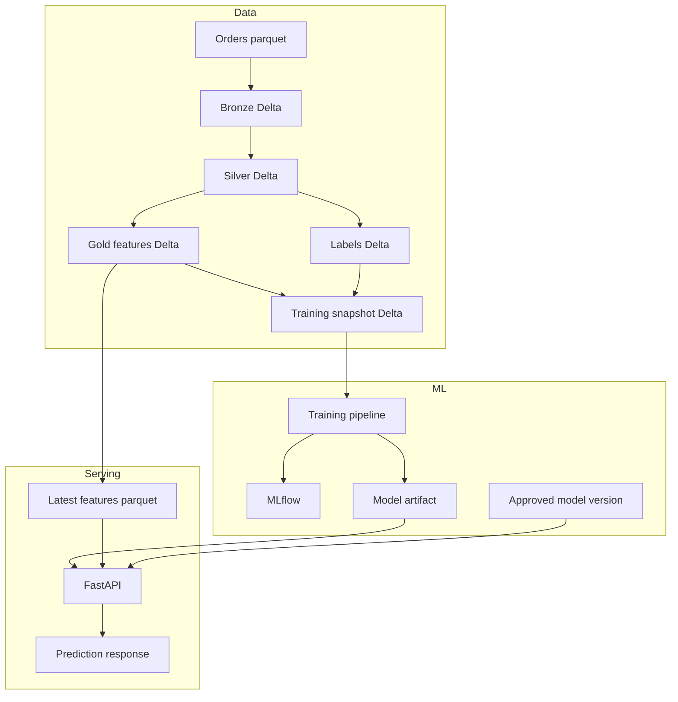

## ARCHITECTURE.md

```md
# Architecture

## 1. Purpose

This repository implements a lean churn-prediction thin slice for e-commerce orders. It is designed to prove the full path from raw data landing to trusted features, model training, MLflow lineage, and online inference.

## 2. Thin-slice boundaries

Included in scope:

- one raw source domain: orders
- one Bronze ingest path
- one Silver trusted publish path with blocking DQ
- one Gold customer feature table
- one label-generation step
- one training snapshot builder
- one baseline logistic-regression training pipeline
- one local/offline latest-features serving layer
- one FastAPI prediction service
- tests, CI, Docker, docs, runbook, and lineage metadata

Explicitly out of scope:

- online feature store
- canary or shadow rollout
- advanced drift monitoring
- multi-environment cloud deployment
- full orchestration layer

## 3. System overview



## 4. Medallion flow

Bronze

Bronze preserves raw evidence and ingestion lineage.

Responsibilities:

read raw parquet as-is
validate required raw source columns and types
append-only Delta write
add ingest metadata:
run_id
ingest_ts
ingest_date
source_file
source_fingerprint
row_count
schema_hash
record an audit table or artifact
skip already-ingested input fingerprints
Silver

Silver is the trusted boundary.

Responsibilities:

normalize keys and timestamps
standardize order_status
deterministically deduplicate by order_id
quarantine malformed and duplicate rejects
enforce blocking DQ rules before publish
publish with ACID-backed merge semantics

Silver blocking checks:

order_id not null
customer_id not null
unique order_id
allowed order_status

Gold

Gold materializes point-in-time-safe customer feature snapshots.

Current Gold grain:

one row per customer_id, as_of_date

Current features:

recency_days
orders_30d
orders_90d
lifetime_orders
customer_tenure_days
avg_days_between_orders

Gold also stamps:

_snapshot_id
_feature_version
_gold_run_id
_gold_ts

## 5. Point-in-time and leakage policy
as_of_date

as_of_date is the snapshot cutoff date for a Gold feature row.

Historical records are eligible for Gold only when:

to_date(order_purchase_ts) <= as_of_date

Feature window policy

All feature windows end at as_of_date, inclusive.

Examples:

orders_30d uses [as_of_date - 29 days, as_of_date]
orders_90d uses [as_of_date - 89 days, as_of_date]
lifetime_orders uses all orders on or before as_of_date
Label window policy

The churn horizon is fixed at 60 days.

Label window:

(as_of_date, as_of_date + 60 days]

Label definition:

churn_label = 1 if no valid future order appears in the next 60 days
churn_label = 0 if at least one valid future order appears in that window

Invalid future-order statuses for label generation:

canceled
unavailable
Training eligibility rule

A snapshot is eligible for training only if the full label horizon is observable:

as_of_date + 60 days <= dataset_end_date

Leakage prevention rules

Gold features must not use:

future orders
future statuses
delivery outcomes
payment outcomes
any field that becomes known only after as_of_date

Feature generation and label generation are separate steps by design.

## 6. Contracts, expectations, and trusted boundaries
Bronze contract

Bronze stores raw shape plus ingestion metadata and a deterministic schema_hash for the source schema.

Silver contract and expectations

Silver has both:

a schema contract in data/contracts/silver/orders.v1.json
expectations in data/expectations/silver/orders.yml

This is the enforceable trust boundary in the repo.

Gold contract

Gold has a strict feature contract in data/contracts/gold/customer_features_daily.v1.json to reduce training-serving skew.

## 7. Versioning and lineage

Lineage is carried through the stack using explicit metadata.

Examples:

Bronze: run_id, schema_hash, source_fingerprint
Silver: _schema_version, _silver_run_id
Gold: _snapshot_id, _feature_version, _gold_run_id
Labels: _label_version, _labels_run_id
Training snapshot: _data_snapshot_id, _training_run_id
Model: model_version, approved_model_version, data_snapshot_id, feature/schema metadata
API response: model_version, feature_version, request_id

The training pipeline also records MLflow artifacts and run metadata so a model can be tied back to the exact feature snapshot and schema.

## 8. Training design

Baseline training pipeline characteristics:

logistic regression
time-based split on as_of_date
class weighting for imbalance
metrics:
PR-AUC
ROC-AUC
Brier score
model artifact persisted locally
model metadata persisted locally
MLflow params, metrics, and artifacts logged

## 9. Serving design

Serving is intentionally local/offline-backed in this version.

Latest-features strategy

The serving layer reads a materialized parquet export of the latest Gold snapshot per customer. The API never recomputes features on request.

Inference flow
authenticate request with API key
load approved model bundle from local artifact path
load latest features store from local parquet path
retrieve features for customer_id
score probability
return prediction with model_version, feature_version, and request_id

## 10. Reliability and observability

Minimal production-minded controls in scope:

pipeline run_id logging
API request_id logging
structured logs
no raw customer id in API logs
readiness and version endpoints
basic counters and latency logging
CI gating on lint, type check, unit/contract tests, and thin integration test

## 11. Deployment stance

This repo supports local execution and API containerization. It is not yet a multi-environment deployment system. That is an intentional scope decision for the thin slice.