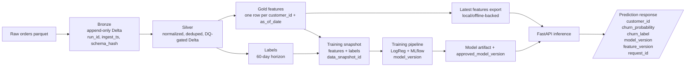

### E-Commerce Churn Lakehouse V2

A lean, portfolio-ready churn prediction system built as an end-to-end thin slice:

- raw orders land in **Bronze**
- trusted, validated orders publish to **Silver**
- point-in-time customer features materialize in **Gold**
- a real baseline model trains on versioned snapshots and logs to **MLflow**
- a **FastAPI** service serves real predictions with `model_version`, `feature_version`, and `request_id`

This repo is intentionally small. The goal is not a full enterprise platform; the goal is a correct, traceable vertical slice that demonstrates data engineering, ML lineage, and production-minded API design.

## Project story

This project answers a simple question in a disciplined way: **which customers are likely to churn in the next 60 days?**

The thin slice is designed to show hiring-signal engineering practices rather than just notebook modeling:

- reproducible data contracts
- idempotent Medallion-style data movement
- blocking data quality at the Silver boundary
- point-in-time-safe Gold features
- versioned training snapshots
- MLflow experiment lineage
- traceable online inference
- CI, tests, runbook, and Docker support

## Thin-slice scope

Included in V2:

- one raw source domain: `orders`
- one Bronze ingest path
- one Silver trusted publish path with a blocking DQ gate
- one Gold feature table
- one label-generation step
- one training snapshot builder
- one real baseline training pipeline
- one local/offline latest-features serving layer
- one real FastAPI prediction endpoint
- CI, Docker, docs, runbook, and traceability metadata

Out of scope for this version:

- online feature store
- canary or shadow deployments
- rich drift tooling
- multi-environment cloud deployment
- full orchestration rollout

## Architecture

## Why this stack

PySpark + Delta Lake

The pipeline needs ACID-backed writes, idempotent reruns, deterministic merges, and Parquet-scale processing. Delta Lake on Spark is the smallest stack in this repo that supports those requirements cleanly.

Repo-managed contracts and expectations

The goal is to make schema and quality assumptions explicit. Bronze captures schema fingerprints, Silver blocks invalid trusted publishes, and Gold locks feature shape to reduce training-serving skew.

Scikit-learn baseline first

A logistic regression baseline is the right first model because it is fast, interpretable, and easy to evaluate. This repo values traceability and correctness over premature model complexity.

MLflow

MLflow gives experiment tracking, metrics, artifacts, data_snapshot_id, feature/schema lineage, and an approved model pointer without introducing a larger platform dependency.

FastAPI

FastAPI keeps the inference service small and explicit: validated request/response schemas, API-key auth, readiness/version endpoints, and structured request logging.

Data model and churn definition
Dataset in scope

This version uses only the orders domain.

Churn definition

A snapshot is labeled as churned (churn_label = 1) at as_of_date if the customer places no valid order in the next 60 days.

A snapshot is labeled as retained (churn_label = 0) if the customer places at least one valid order in the window:

(as_of_date, as_of_date + 60 days]

Valid future orders exclude statuses in the invalid bucket:

canceled
unavailable

Training eligibility rule

A snapshot is eligible for training only if the full future label window is observable:

as_of_date + 60 days <= dataset_end_date

Point-in-time rule

Gold features may only use data with:

to_date(order_purchase_ts) <= as_of_date

Core repo layout

src/
  ingestion/orders_to_bronze.py
  transformations/orders_bronze_to_silver.py
  features/customer_features_daily.py
  training/labels.py
  training/build_training_snapshot.py
  training/train_stub.py
  serving_features/build_latest_features.py

services/api/
  app/main.py
  app/routers/predict.py
  app/inference/model_loader.py
  app/feature_client/local_latest_features.py
  app/auth/api_key.py
  app/observability/logging.py

data/contracts/
  bronze/orders.v1.json
  silver/orders.v1.json
  gold/customer_features_daily.v1.json
Prerequisites
Python 3.11
Java 11 for Spark
uv
Local setup
uv sync --dev
export SPARK_LOCAL_IP=127.0.0.1
export API_KEY=dev-api-key
Manual end-to-end run

Prepare an input parquet file with the Bronze source schema:

order_id
customer_id
order_status
order_purchase_timestamp
order_approved_at
order_delivered_carrier_date
order_delivered_customer_date
order_estimated_delivery_date

Set a few local paths:

export RUN_ID=$(python -c "import uuid; print(uuid.uuid4())")
export INPUT_PARQUET=/absolute/path/to/orders.parquet
export LAKEHOUSE_ROOT=$PWD/lakehouse
export ARTIFACTS_ROOT=$PWD/artifacts
mkdir -p "$LAKEHOUSE_ROOT" "$ARTIFACTS_ROOT"

1) Bronze ingest
python -m src.ingestion.orders_to_bronze \
  --input "$INPUT_PARQUET" \
  --bronze_path "$LAKEHOUSE_ROOT/bronze/orders" \
  --run_id "$RUN_ID"

2) Silver publish with blocking DQ
python -m src.transformations.orders_bronze_to_silver \
  --bronze_path "$LAKEHOUSE_ROOT/bronze/orders" \
  --silver_path "$LAKEHOUSE_ROOT/silver/orders" \
  --contract data/contracts/silver/orders.v1.json \
  --expectations data/expectations/silver/orders.yml \
  --run_id "$RUN_ID"

3) Gold features for one snapshot date
python -m src.features.customer_features_daily \
  --silver_path "$LAKEHOUSE_ROOT/silver/orders" \
  --gold_path "$LAKEHOUSE_ROOT/gold/customer_features_daily" \
  --contract data/contracts/gold/customer_features_daily.v1.json \
  --as_of_date 2025-03-31 \
  --run_id "$RUN_ID-gold-2025-03-31"

4) Labels for the same snapshot date
python -m src.training.labels \
  --silver_path "$LAKEHOUSE_ROOT/silver/orders" \
  --labels_path "$LAKEHOUSE_ROOT/gold/customer_labels_daily" \
  --as_of_date 2025-03-31 \
  --run_id "$RUN_ID-labels-2025-03-31" \
  --metadata_path "$ARTIFACTS_ROOT/labels/2025-03-31.json"

5) Training snapshot assembly
python -m src.training.build_training_snapshot \
  --gold_path "$LAKEHOUSE_ROOT/gold/customer_features_daily" \
  --labels_path "$LAKEHOUSE_ROOT/gold/customer_labels_daily" \
  --training_snapshot_path "$LAKEHOUSE_ROOT/training/customer_training_snapshot" \
  --run_id "$RUN_ID-snapshot" \
  --metadata_path "$ARTIFACTS_ROOT/training/snapshot.json"

6) Train baseline model and log to MLflow
python -m src.training.train_stub \
  --training_snapshot_path "$LAKEHOUSE_ROOT/training/customer_training_snapshot" \
  --feature_contract data/contracts/gold/customer_features_daily.v1.json \
  --out_model_path "$ARTIFACTS_ROOT/models/ecomm_churn_baseline.pkl" \
  --out_model_meta "$ARTIFACTS_ROOT/models/model_meta.json" \
  --evaluation_summary_path "$ARTIFACTS_ROOT/models/evaluation_summary.md" \
  --approved_model_version_path "$ARTIFACTS_ROOT/models/approved_model_version.json" \
  --feature_schema_info_path "$ARTIFACTS_ROOT/models/feature_schema_info.json" \
  --model_name ecomm-churn \
  --validation_fraction 0.20 \
  --run_id "$RUN_ID-train" \
  --mlflow_tracking_uri "file:$ARTIFACTS_ROOT/mlruns" \
  --mlflow_experiment ecomm-churn-local

7) Build the latest-features serving export
python -m src.serving_features.build_latest_features \
  --gold_path "$LAKEHOUSE_ROOT/gold/customer_features_daily" \
  --latest_features_path "$ARTIFACTS_ROOT/serving/latest_features" \
  --run_id "$RUN_ID-serving" \
  --manifest_path "$ARTIFACTS_ROOT/serving/latest_features_manifest.json"

8) Start the API

export MODEL_PATH="$ARTIFACTS_ROOT/models/ecomm_churn_baseline.pkl"
export MODEL_META_PATH="$ARTIFACTS_ROOT/models/model_meta.json"
export APPROVED_MODEL_VERSION_PATH="$ARTIFACTS_ROOT/models/approved_model_version.json"
export LATEST_FEATURES_PATH="$ARTIFACTS_ROOT/serving/latest_features"

uv run uvicorn services.api.app.main:app --reload
Fast validation path
uv run pytest tests/unit tests/contract services/api/tests -q
uv run pytest tests/integration/test_slice_e2e.py -q -m e2e

Sample API request

    curl -X POST "http://127.0.0.1:8000/v1/churn/predict" \
    -H "Content-Type: application/json" \
    -H "X-API-Key: dev-api-key" \
    -d '{"customer_id":"cust_0001"}'

Sample API response

    {
    "customer_id": "cust_0001",
    "churn_probability": 0.731245,
    "churn_label": 1,
    "model_version": "3a4d9a4c5f8b12de",
    "feature_version": "8b2c84d1a7e62b91",
    "request_id": "0c9f4a1f-6f74-4d88-b7d1-8ce4cf93db17"
    }

API endpoints
    POST /v1/churn/predict
    GET /health
    GET /ready
    GET /version
    GET /metrics
    CI

The CI workflow runs:

    Ruff
    Black check
    MyPy
    unit tests
    contract tests
    API tests
    thin integration test
    
Documentation map

    ARCHITECTURE.md
    RUNBOOK.md
    CHANGELOG.md
    docs/adr/ADR-0001.md
    docs/adr/ADR-0002.md
    docs/adr/ADR-0003.md